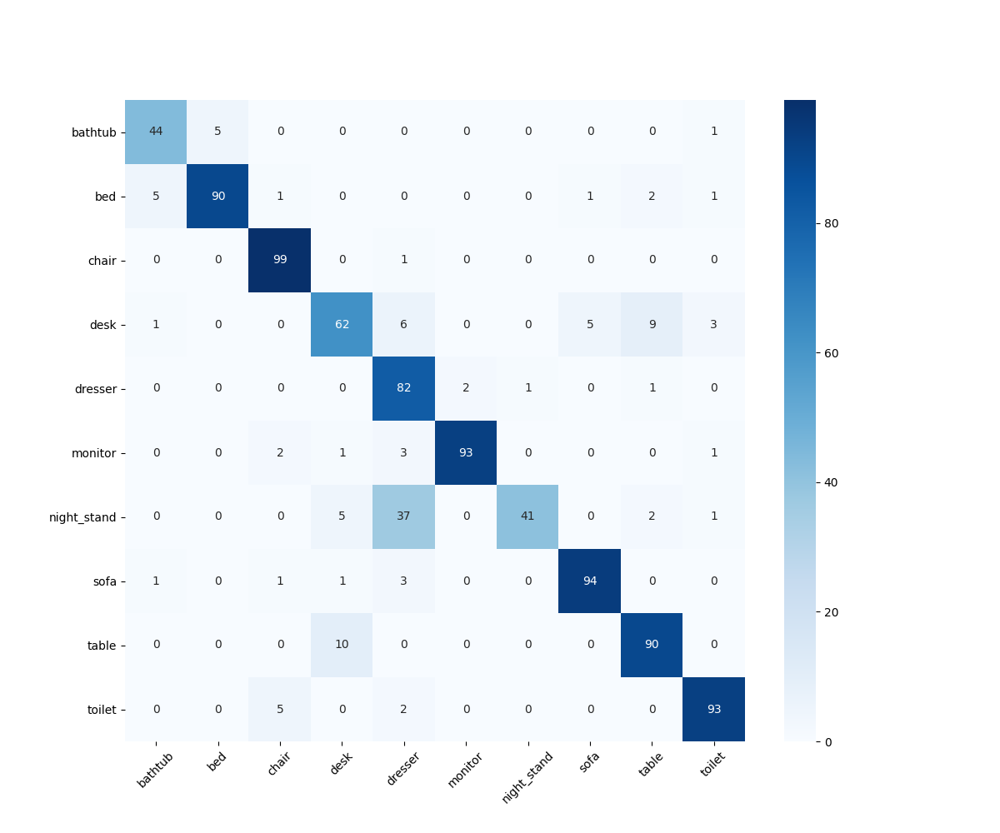
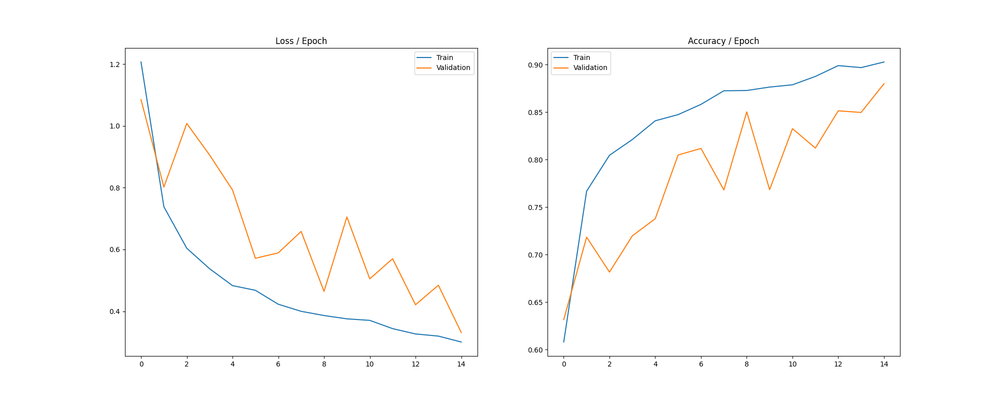
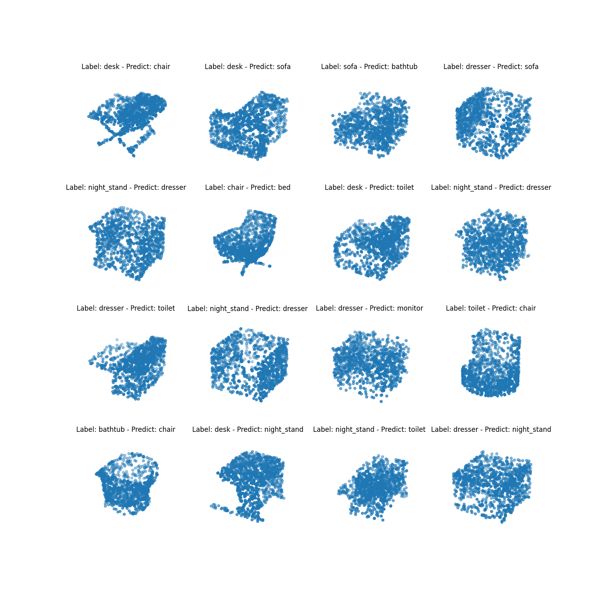

# PointNet Classification

## Results

<table style="text-align: center;">
    <thead>
        <tr>
            <th colspan=2 style="text-align: center;">Accuracy</th>
        </tr>
        <tr>
            <th>Train Set</th>
            <th>Test Set</th>
        </tr>
    </thead>
    <tr>
        <td>90%</td>
        <td>88%</td>
    </tr>
</table>

*Note: Test set is used here (instead of validation set), But, I didn't use it for hyperparameter tunning and etc. (parameters are from the resources below)

#### Some misclassified point clouds
 

---

## Usage
- Download the dataset: `sh download_dataset.sh`
- Creating Virtual Environment: `python3 -m venv .venv`
    - Activate it using
        - Unix or MacOS: `source .venv/bin/activate`
        - Windows: `.env/Scripts/activate.bat`
- Installing requirements: `pip install -r requirements.txt`
- Training the model: `python3 train.py`
    - Or you can run it in the background: `nohup python3 train.py > output.log &`
- Testing the model: `python3 test.py`
    - You can also see the images saved inside `images` folder (Containing **confusion matrix** and **misclassified inputs figure**).

---

## Resources

...